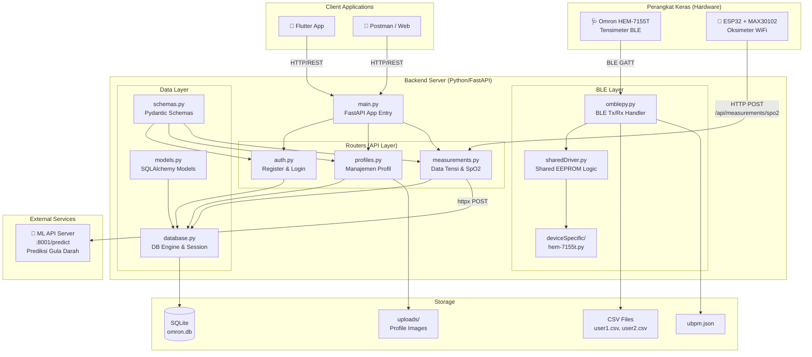
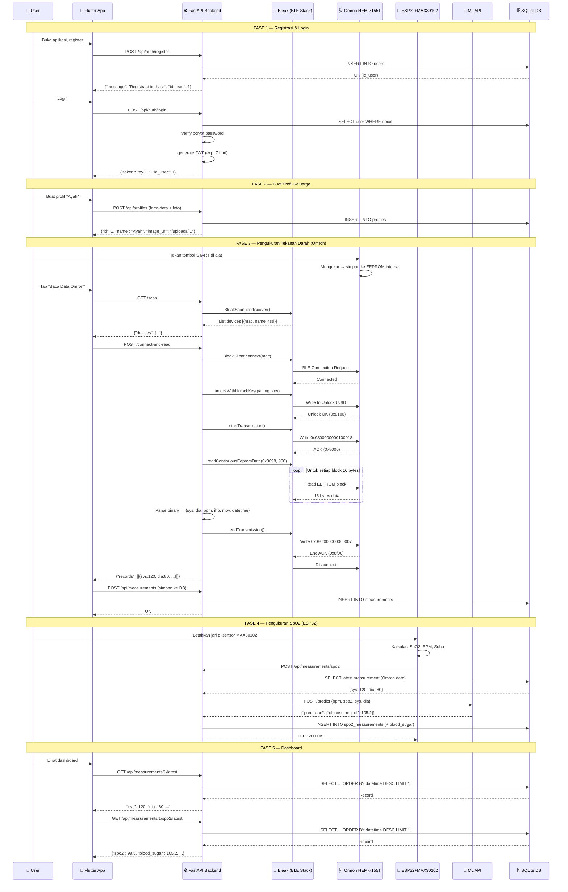
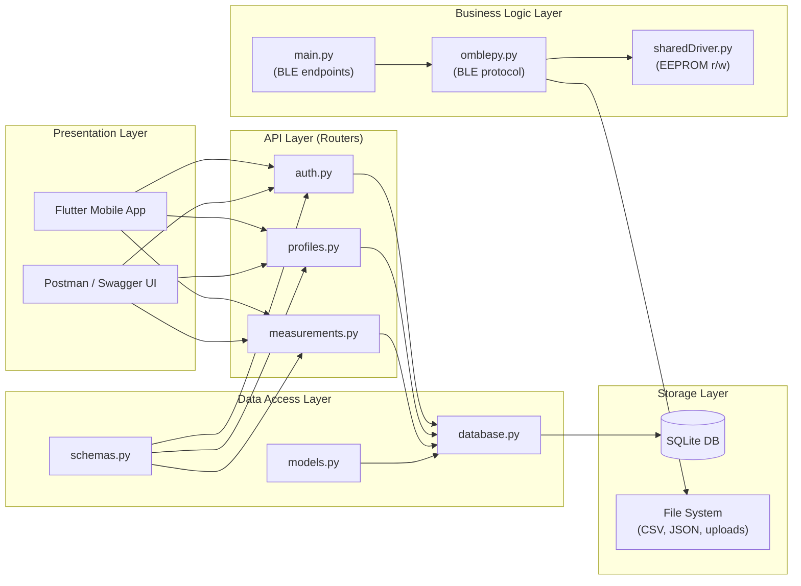
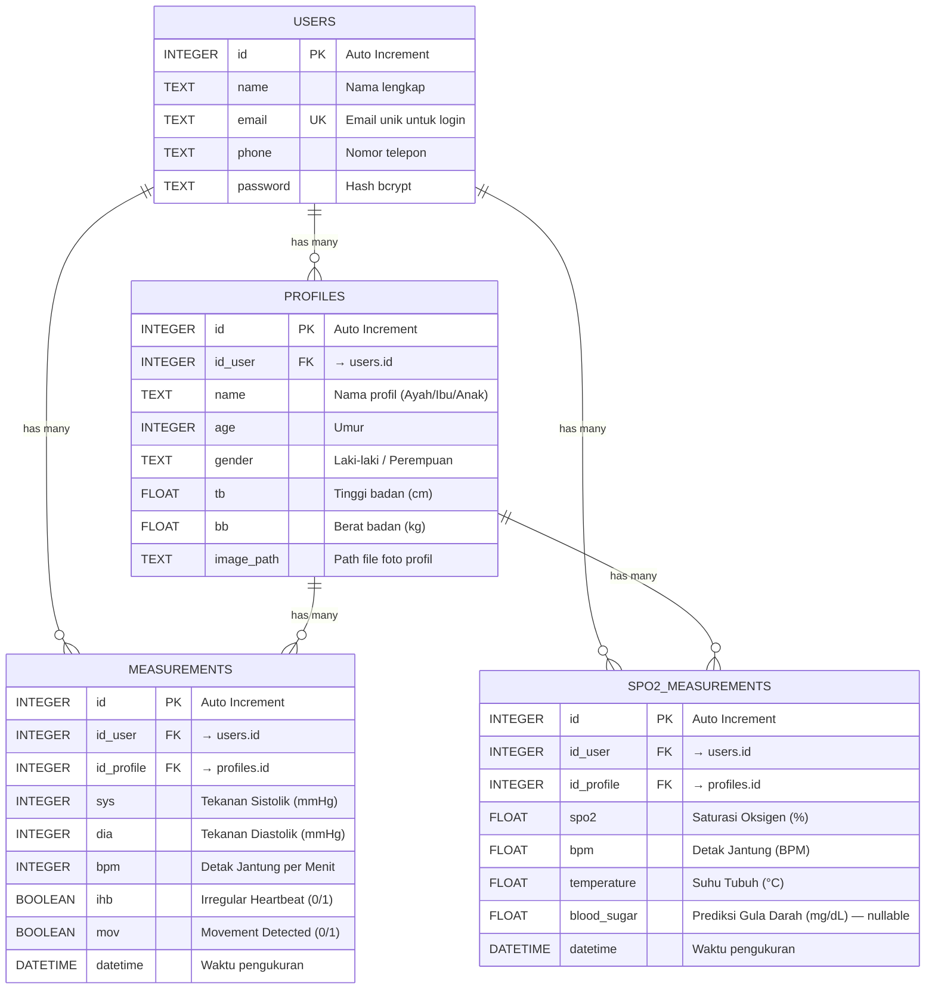
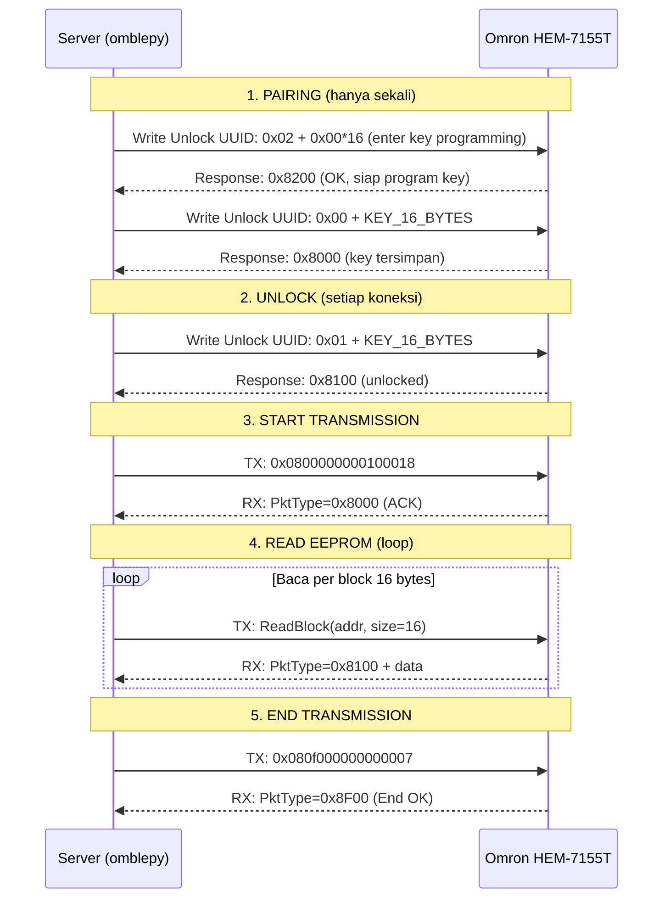
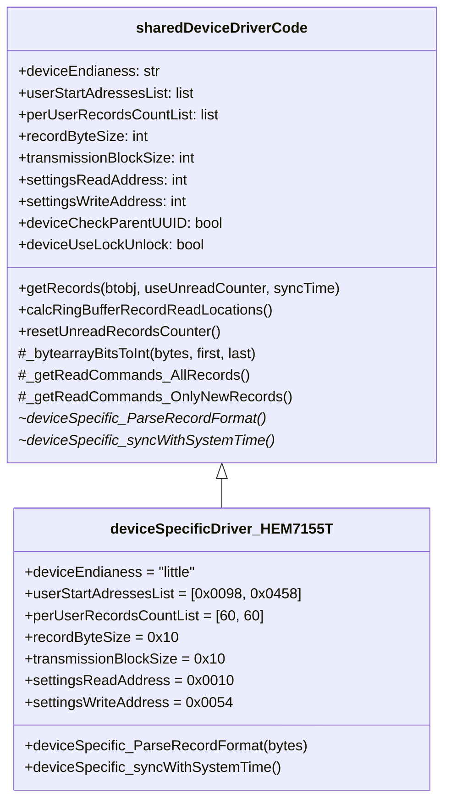
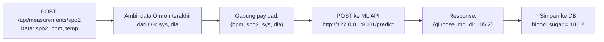
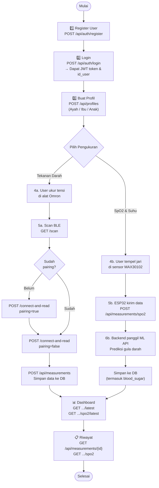

# 📖 Dokumentasi Teknis Lengkap — HEM7155T-Python Backend

> **Proyek Skripsi:** Sistem Monitoring Kesehatan Terintegrasi  
> **Perangkat:** Omron HEM-7155T (Tensimeter BLE) + ESP32/MAX30102 (Oksimeter)  
> **Bahasa:** Python 3.10+  
> **Framework:** FastAPI + SQLAlchemy + Bleak (BLE)

---

## 📋 Daftar Isi

- [1. Gambaran Umum Sistem](#1-gambaran-umum-sistem)
- [2. Prasyarat (Prerequisites)](#2-prasyarat-prerequisites)
- [3. Arsitektur Sistem](#3-arsitektur-sistem)
- [4. Struktur Direktori & Penjelasan File](#4-struktur-direktori--penjelasan-file)
- [5. Skema Database (ERD)](#5-skema-database-erd)
- [6. Modul BLE Omron (omblepy)](#6-modul-ble-omron-omblepy)
- [7. Device Driver (deviceSpecific)](#7-device-driver-devicespecific)
- [8. REST API Endpoints](#8-rest-api-endpoints)
- [9. Integrasi Machine Learning (Prediksi Gula Darah)](#9-integrasi-machine-learning-prediksi-gula-darah)
- [10. WebSocket](#10-websocket)
- [11. Utility Scripts](#11-utility-scripts)
- [12. Instalasi & Deployment](#12-instalasi--deployment)
- [13. Konfigurasi Environment](#13-konfigurasi-environment)
- [14. Alur Penggunaan End-to-End](#14-alur-penggunaan-end-to-end)
- [15. Troubleshooting](#15-troubleshooting)
- [16. Catatan Keamanan](#16-catatan-keamanan)

---

## 1. Gambaran Umum Sistem

Sistem ini adalah **backend server** yang berfungsi sebagai:

1. **Gateway BLE** — Menjembatani komunikasi Bluetooth Low Energy antara perangkat tensimeter Omron HEM-7155T dengan aplikasi client (mobile/web).
2. **REST API Server** — Menyediakan endpoint untuk autentikasi pengguna, manajemen profil keluarga, dan penyimpanan/pengambilan data pengukuran kesehatan.
3. **Data Aggregator** — Menggabungkan data dari dua sumber perangkat keras berbeda (Omron via BLE dan ESP32/MAX30102 via WiFi/HTTP) ke dalam satu database terpadu.
4. **ML Gateway** — Menghubungkan data sensor ke layanan Machine Learning eksternal untuk prediksi kadar gula darah (*blood glucose estimation*).

### Konteks Perangkat Keras

| Perangkat | Fungsi | Koneksi ke Backend |
|-----------|--------|-------------------|
| **Omron HEM-7155T** | Mengukur tekanan darah (Sistolik, Diastolik, BPM) + deteksi IHB & gerakan | Bluetooth Low Energy (BLE) via library `bleak` |
| **ESP32 + MAX30102** | Mengukur saturasi oksigen (SpO2), detak jantung (BPM), dan suhu tubuh | WiFi → HTTP POST ke endpoint `/api/measurements/spo2` |

---

## 2. Prasyarat (Prerequisites)

### 2.1 Perangkat Keras (Hardware)

| Komponen | Spesifikasi | Keterangan |
|----------|-------------|------------|
| **Komputer/Laptop** | Windows 10/11 dengan adapter Bluetooth 4.0+ (BLE) | Sebagai host server backend |
| **Omron HEM-7155T** | Tensimeter digital Omron dengan BLE | Mendukung 2 user slot, masing-masing 60 record |
| **ESP32 DevKit** | ESP32 atau ESP32-C3 | Mikrokontroler untuk sensor SpO2 |
| **MAX30102** | Sensor pulse oximeter dan heart-rate | Terhubung ke ESP32 via I2C |
| **Jaringan WiFi** | LAN yang sama antara ESP32 dan server | Untuk komunikasi HTTP ESP32 → Backend |

### 2.2 Perangkat Lunak (Software)

| Software | Versi Minimum | Fungsi |
|----------|---------------|--------|
| **Python** | 3.10+ | Runtime utama backend |
| **pip** | Latest | Package manager Python |
| **Git** | Latest | Version control |
| **Bluetooth Driver** | Windows built-in | Driver BLE untuk `bleak` |
| **Arduino IDE** *(opsional)* | 2.x | Untuk flash firmware ESP32 |

### 2.3 Pustaka Python (Dependencies)

Semua tercantum di [requirements.txt](file:///c:/KULIAH/SKRIPSI/HEM7155T-Python/requirements.txt):

| Package | Versi | Fungsi |
|---------|-------|--------|
| `fastapi` | 0.115.12 | Web framework async untuk REST API |
| `uvicorn` | 0.34.2 | ASGI server untuk menjalankan FastAPI |
| `bleak` | 0.22.3 | Library BLE cross-platform untuk Python |
| `sqlalchemy` | 2.0.40 | ORM untuk interaksi database SQLite |
| `pydantic` | 2.11.4 | Validasi data dan serialisasi (sudah termasuk dalam FastAPI) |
| `passlib[bcrypt]` | 1.7.4 | Hashing password (bcrypt) |
| `bcrypt` | <5 | Backend hashing untuk passlib |
| `python-jose[cryptography]` | 3.3.0 | Pembuatan dan verifikasi JWT token |
| `python-dotenv` | 1.0.1 | Memuat variabel environment dari file `.env` |
| `python-multipart` | 0.0.20 | Parsing `multipart/form-data` (upload file) |
| `matplotlib` | 3.10.1 | Plotting grafik CSV (utility) |
| `numpy` | 2.2.5 | Komputasi numerik untuk plotting |
| `terminaltables` | 3.1.10 | Tabel ASCII untuk CLI mode |
| `httpx` | *(implicit)* | HTTP client untuk memanggil ML API |

---

## 3. Arsitektur Sistem

### 3.1 Diagram Arsitektur High-Level



### 3.2 Diagram Sequence — Alur Lengkap Pengukuran



### 3.3 Diagram Komponen Layer



---

## 4. Struktur Direktori & Penjelasan File

```
HEM7155T-Python/
├── .env                        # Variabel environment (SECRET_KEY, ML_API_URL)
├── .env.example                # Template .env untuk referensi
├── .gitignore                  # File yang diabaikan Git
├── requirements.txt            # Daftar dependency Python
├── README.md                   # Dokumentasi ringkas (lama)
├── readmeNEW.md                # Dokumentasi API lengkap (baru)
│
├── main.py                     # ⭐ Entry point aplikasi FastAPI
├── database.py                 # Konfigurasi engine SQLAlchemy & session
├── models.py                   # Definisi ORM model (User, Profile, Measurement, Spo2)
├── schemas.py                  # Pydantic schema validasi request/response
│
├── routers/                    # API Route handlers
│   ├── auth.py                 # Register & Login (JWT)
│   ├── profiles.py             # CRUD profil keluarga
│   └── measurements.py         # CRUD data pengukuran (tensi + SpO2 + ML)
│
├── omblepy.py                  # ⭐ Core BLE handler (Tx/Rx, EEPROM r/w, pairing)
├── sharedDriver.py             # ⭐ Shared driver logic (record read, ring buffer)
├── omblepy_bridge.py           # Bridge via ESP32 Serial (alternatif BLE)
├── websocket.py                # WebSocket endpoint untuk BLE real-time
│
├── deviceSpecific/             # Driver per model perangkat Omron
│   ├── hem-7155t.py            # ⭐ Driver HEM-7155T (parse binary, time sync)
│   ├── hem-6232t.py            # Driver HEM-6232T
│   ├── hem-7142t.py            # Driver HEM-7142T
│   ├── hem-7150t.py            # Driver HEM-7150T
│   ├── hem-7322t.py            # Driver HEM-7322T
│   ├── hem-7342t.py            # Driver HEM-7342T
│   ├── hem-7361t.py            # Driver HEM-7361T
│   ├── hem-7530t.py            # Driver HEM-7530T
│   ├── hem-7600t.py            # Driver HEM-7600T
│   └── hem_7142t.py            # Alias driver (underscore variant)
│
├── omblepy-esp32bridge/        # Subproject: ESP32 sebagai BLE bridge
│   ├── README.md               # Dokumentasi bridge
│   ├── omblepy.py              # Versi omblepy untuk bridge
│   ├── omblepy_bridge.py       # Serial communication handler
│   ├── sharedDriver.py         # Shared driver (bridge version)
│   ├── plotCsv.py              # Plot utility
│   ├── deviceSpecific/         # Device drivers (bridge version)
│   └── esp32bridge/            # Firmware ESP32 untuk BLE bridge
│
├── plotCsv.py                  # 📊 Utility: plot tekanan darah dari CSV
├── migrate_db.py               # 🔧 Migrasi DB: tambah kolom blood_sugar
├── secretkey-generate.py       # 🔑 Utility: generate SECRET_KEY
│
├── omron.db                    # 🗄️ File database SQLite
├── ubpm.json                   # Output JSON format UBPM
├── uploads/                    # Direktori penyimpanan foto profil
└── .vscode/                    # Konfigurasi VS Code
```

### Penjelasan Detail Per File

#### File Utama (Core)

| File | Baris | Fungsi |
|------|-------|--------|
| [main.py](file:///c:/KULIAH/SKRIPSI/HEM7155T-Python/main.py) | 365 | Entry point FastAPI. Mendaftarkan router, middleware CORS, endpoint BLE (`/scan`, `/connect-and-read`, `/latest-bp-records`), dan melakukan auto-migration kolom database saat startup. |
| [database.py](file:///c:/KULIAH/SKRIPSI/HEM7155T-Python/database.py) | 16 | Konfigurasi SQLAlchemy engine (`sqlite:///./omron.db`), session factory, dan dependency injection `get_db()`. |
| [models.py](file:///c:/KULIAH/SKRIPSI/HEM7155T-Python/models.py) | 67 | Definisi 4 tabel ORM: `User`, `Profile`, `Measurement`, `Spo2Measurement` beserta relasi antar tabel. |
| [schemas.py](file:///c:/KULIAH/SKRIPSI/HEM7155T-Python/schemas.py) | 96 | Pydantic schema untuk validasi input dan serialisasi output pada setiap endpoint API. |

#### Router Files

| File | Baris | Fungsi |
|------|-------|--------|
| [auth.py](file:///c:/KULIAH/SKRIPSI/HEM7155T-Python/routers/auth.py) | 63 | `POST /register` — hash password bcrypt, simpan user. `POST /login` — verifikasi password, generate JWT token (exp 7 hari, algoritma HS256). |
| [profiles.py](file:///c:/KULIAH/SKRIPSI/HEM7155T-Python/routers/profiles.py) | 96 | `POST /` — buat profil dengan upload foto (multipart). `GET /{id_user}` — list profil. `DELETE /{id_profile}` — hapus profil + file foto. |
| [measurements.py](file:///c:/KULIAH/SKRIPSI/HEM7155T-Python/routers/measurements.py) | 164 | CRUD data tensi & SpO2. Pada `POST /spo2`, melakukan: validasi profil → ambil data Omron terakhir → kirim ke ML API → simpan hasil prediksi gula darah. |

#### BLE Layer

| File | Baris | Fungsi |
|------|-------|--------|
| [omblepy.py](file:///c:/KULIAH/SKRIPSI/HEM7155T-Python/omblepy.py) | 448 | **Core BLE handler.** Class `bluetoothTxRxHandler` mengelola: Rx/Tx via 4 channel UUID, CRC check (XOR), EEPROM read/write, pairing key management, dan transmission control. Juga berisi fungsi utilitas: `scanBLEDevices()`, `appendCsv()`, `saveUBPMJson()`. |
| [sharedDriver.py](file:///c:/KULIAH/SKRIPSI/HEM7155T-Python/sharedDriver.py) | 142 | **Shared device driver base class.** Mengelola: ring buffer EEPROM reading, unread records counter, time synchronization, dan binary-to-integer bit extraction. Semua device driver di `deviceSpecific/` mewarisi class ini. |
| [omblepy_bridge.py](file:///c:/KULIAH/SKRIPSI/HEM7155T-Python/omblepy_bridge.py) | 281 | Alternatif handler yang menggunakan ESP32 sebagai BLE bridge via serial port (COM). Data BLE di-relay melalui serial dan di-encode/decode dengan base64. |
| [websocket.py](file:///c:/KULIAH/SKRIPSI/HEM7155T-Python/websocket.py) | 82 | WebSocket endpoint `ws://host:8000/ws/bp-data` untuk komunikasi BLE real-time (pairing & data reading via WebSocket alih-alih REST). |

---

## 5. Skema Database (ERD)

### 5.1 Entity Relationship Diagram



### 5.2 Detail Tabel

#### Tabel `users`
| Kolom | Tipe | Constraint | Keterangan |
|-------|------|-----------|------------|
| `id` | INTEGER | PRIMARY KEY, AUTO INCREMENT | ID unik user |
| `name` | TEXT | NOT NULL | Nama lengkap |
| `email` | TEXT | UNIQUE, NOT NULL | Email untuk login |
| `phone` | TEXT | NOT NULL | Nomor telepon |
| `password` | TEXT | NOT NULL | Password ter-hash (bcrypt) |

#### Tabel `profiles`
| Kolom | Tipe | Constraint | Keterangan |
|-------|------|-----------|------------|
| `id` | INTEGER | PRIMARY KEY, AUTO INCREMENT | ID unik profil |
| `id_user` | INTEGER | FOREIGN KEY → `users.id`, NOT NULL | Pemilik profil |
| `name` | TEXT | NOT NULL | Nama profil (misal: Ayah, Ibu) |
| `age` | INTEGER | NOT NULL | Umur |
| `gender` | TEXT | NOT NULL | Jenis kelamin |
| `tb` | FLOAT | NOT NULL | Tinggi badan (cm) |
| `bb` | FLOAT | NOT NULL | Berat badan (kg) |
| `image_path` | TEXT | NULLABLE | Path absolut file foto profil |

#### Tabel `measurements`
| Kolom | Tipe | Constraint | Keterangan |
|-------|------|-----------|------------|
| `id` | INTEGER | PRIMARY KEY, AUTO INCREMENT | ID unik record |
| `id_user` | INTEGER | FOREIGN KEY → `users.id`, NOT NULL | Pemilik data |
| `id_profile` | INTEGER | FOREIGN KEY → `profiles.id`, NOT NULL | Profil terkait |
| `sys` | INTEGER | NOT NULL | Tekanan Sistolik (mmHg) |
| `dia` | INTEGER | NOT NULL | Tekanan Diastolik (mmHg) |
| `bpm` | INTEGER | NOT NULL | Detak jantung per menit |
| `ihb` | BOOLEAN | DEFAULT FALSE | Irregular Heartbeat detected |
| `mov` | BOOLEAN | DEFAULT FALSE | Movement detected |
| `datetime` | DATETIME | DEFAULT UTC NOW | Waktu pengukuran |

#### Tabel `spo2_measurements`
| Kolom | Tipe | Constraint | Keterangan |
|-------|------|-----------|------------|
| `id` | INTEGER | PRIMARY KEY, AUTO INCREMENT | ID unik record |
| `id_user` | INTEGER | FOREIGN KEY → `users.id`, NOT NULL | Pemilik data |
| `id_profile` | INTEGER | FOREIGN KEY → `profiles.id`, NOT NULL | Profil terkait |
| `spo2` | FLOAT | NOT NULL | Saturasi oksigen (%) |
| `bpm` | FLOAT | NOT NULL | Detak jantung (BPM) |
| `temperature` | FLOAT | NOT NULL | Suhu tubuh (°C) |
| `blood_sugar` | FLOAT | NULLABLE | Prediksi gula darah dari ML (mg/dL) |
| `datetime` | DATETIME | DEFAULT UTC NOW | Waktu pengukuran |

---

## 6. Modul BLE Omron (omblepy)

### 6.1 Arsitektur Protokol BLE

Perangkat Omron HEM-7155T menggunakan protokol BLE GATT kustom (bukan standar *Blood Pressure Profile*) yang berkomunikasi melalui **service dan characteristic UUID spesifik**:

```
Parent Service UUID: ecbe3980-c9a2-11e1-b1bd-0002a5d5c51b
```

#### Channel UUID Mapping

| Channel | Direction | UUID | Fungsi |
|---------|-----------|------|--------|
| TX Ch0 | Server → Device | `db5b55e0-aee7-11e1-965e-0002a5d5c51b` | Kirim command |
| TX Ch1 | Server → Device | `e0b8a060-aee7-11e1-92f4-0002a5d5c51b` | Kirim command (lanjutan) |
| TX Ch2 | Server → Device | `0ae12b00-aee8-11e1-a192-0002a5d5c51b` | Kirim command (lanjutan) |
| TX Ch3 | Server → Device | `10e1ba60-aee8-11e1-89e5-0002a5d5c51b` | Kirim command (lanjutan) |
| RX Ch0 | Device → Server | `49123040-aee8-11e1-a74d-0002a5d5c51b` | Terima response |
| RX Ch1 | Device → Server | `4d0bf320-aee8-11e1-a0d9-0002a5d5c51b` | Terima response (lanjutan) |
| RX Ch2 | Device → Server | `5128ce60-aee8-11e1-b84b-0002a5d5c51b` | Terima response (lanjutan) |
| RX Ch3 | Device → Server | `560f1420-aee8-11e1-8184-0002a5d5c51b` | Terima response (lanjutan) |
| Unlock | Bidirectional | `b305b680-aee7-11e1-a730-0002a5d5c51b` | Pairing & unlock key |

### 6.2 Format Paket Data BLE

```
┌──────────┬────────────┬──────────────┬──────────┬──────────┬─────────┬──────┐
│ Byte 0   │ Byte 1-2   │ Byte 3-4     │ Byte 5   │ Byte 6-N │ Byte N+1│Byte N+2│
│ PktSize  │ PktType    │ EEPROM Addr  │ DataLen  │ Data     │ 0x00   │ CRC  │
└──────────┴────────────┴──────────────┴──────────┴──────────┴─────────┴──────┘
```

- **PktSize**: Total ukuran paket (termasuk header 6 byte + CRC 2 byte)
- **PktType**: Tipe paket command/response
- **EEPROM Addr**: Alamat EEPROM yang dibaca/ditulis
- **DataLen**: Jumlah byte data aktual
- **CRC**: XOR checksum seluruh paket

#### Tipe Paket (Packet Types)

| Hex Code | Arah | Keterangan |
|----------|------|-----------|
| `0x0800` | TX | Start Data Readout |
| `0x8000` | RX | ACK Start Readout |
| `0x0100` | TX | Read EEPROM Block |
| `0x8100` | RX | EEPROM Read Response |
| `0x01C0` | TX | Write EEPROM Block |
| `0x81C0` | RX | EEPROM Write Response |
| `0x0F00` | TX | End Transmission |
| `0x8F00` | RX | ACK End Transmission |

### 6.3 Alur Komunikasi BLE



### 6.4 Class `bluetoothTxRxHandler`

Defined in [omblepy.py](file:///c:/KULIAH/SKRIPSI/HEM7155T-Python/omblepy.py):

| Method | Fungsi |
|--------|--------|
| `__init__(ble_client)` | Inisialisasi buffer Rx, channel mapping |
| `startTransmission()` | Mulai sesi data readout |
| `endTransmission()` | Akhiri sesi data readout |
| `writeNewUnlockKey(key)` | Program pairing key 16-byte ke perangkat |
| `unlockWithUnlockKey(key)` | Unlock perangkat dengan key yang sudah dipasang |
| `readContinuousEepromData(addr, size)` | Baca blok EEPROM secara kontinu |
| `writeContinuousEepromData(addr, data)` | Tulis blok EEPROM secara kontinu |
| `_waitForRxOrRetry(command)` | Kirim command, tunggu response, retry max 3x |
| `_callbackForRxChannels(char, data)` | Callback ketika data diterima dari notification |

---

## 7. Device Driver (deviceSpecific)

### 7.1 Inheritance Hierarchy



### 7.2 HEM-7155T Memory Map (EEPROM Layout)

```
┌───────────┬───────────────────────────────────────────┐
│ Address   │ Content                                   │
├───────────┼───────────────────────────────────────────┤
│ 0x0010    │ Settings Read Start                       │
│ 0x0010-   │ Unread Records Counter (16 bytes)         │
│  0x001F   │   Slot pos User1 (2B) + User2 (2B)       │
│           │   Unread count User1 (2B) + User2 (2B)   │
│ 0x003C-   │ Time Sync Settings (16 bytes)             │
│  0x004B   │   8 bytes config + 6 bytes Y/M/D/H/M/S   │
│           │   + 1 byte checksum + 1 byte padding      │
│ 0x0054    │ Settings Write Start                      │
│           │                                           │
│ 0x0098    │ ▶ User 1 Records Start                    │
│ 0x0098-   │   60 records × 16 bytes = 960 bytes       │
│  0x0457   │   Ring buffer format                      │
│           │                                           │
│ 0x0458    │ ▶ User 2 Records Start                    │
│ 0x0458-   │   60 records × 16 bytes = 960 bytes       │
│  0x0817   │   Ring buffer format                      │
└───────────┴───────────────────────────────────────────┘
```

### 7.3 Binary Record Format (16 bytes per record)

Data pengukuran disimpan dalam format binary yang kompak. Parsing dilakukan secara bit-level:

```
Byte/Bit:  [0-7][8-15] [16-23][24-31] [32-39][40-47] [48-55][56-63]
           [64-67][68-73][74-79]  [80][81] [82-85][86-90][91-95]
           [96-97][98-103] [104-111] [112-119] [120-127]

Mapping:
├── Bit  68-73:  minute  (0-59)
├── Bit  74-79:  second  (0-59, capped)
├── Bit  80:     mov     (movement flag)
├── Bit  81:     ihb     (irregular heartbeat flag)
├── Bit  82-85:  month   (1-12)
├── Bit  86-90:  day     (1-31)
├── Bit  91-95:  hour    (0-23)
├── Bit  98-103: year    (+ 2000)
├── Bit 104-111: bpm     (beats per minute)
├── Bit 112-119: dia     (diastolic pressure)
└── Bit 120-127: sys     (systolic pressure + 25)
```

> [!IMPORTANT]
> Nilai `sys` yang dibaca dari EEPROM harus ditambah **+25** untuk mendapatkan nilai tekanan sistolik sebenarnya. Ini adalah offset yang di-hardcode oleh Omron.

---

## 8. REST API Endpoints

### 8.1 Ringkasan Endpoint

| # | Method | Endpoint | Auth | Fungsi |
|---|--------|----------|------|--------|
| 1 | `GET` | `/` | ❌ | Health check server |
| 2 | `GET` | `/ui` | ❌ | Serve halaman frontend (HTML) |
| 3 | `GET` | `/scan` | ❌ | Scan perangkat BLE terdekat |
| 4 | `POST` | `/connect-and-read` | ❌ | Connect, pair/read data Omron |
| 5 | `POST` | `/latest-bp-records` | ❌ | Connect & read hanya record terbaru |
| 6 | `POST` | `/api/auth/register` | ❌ | Registrasi user baru |
| 7 | `POST` | `/api/auth/login` | ❌ | Login, mendapat JWT token |
| 8 | `POST` | `/api/profiles` | ❌ | Buat profil baru (+ upload foto) |
| 9 | `GET` | `/api/profiles/{id_user}` | ❌ | List semua profil milik user |
| 10 | `DELETE` | `/api/profiles/{id_profile}` | ❌ | Hapus profil |
| 11 | `POST` | `/api/measurements` | ❌ | Simpan data pengukuran tensi |
| 12 | `GET` | `/api/measurements/{id_profile}` | ❌ | List riwayat tensi (desc) |
| 13 | `GET` | `/api/measurements/{id_profile}/latest` | ❌ | Pengukuran tensi terbaru |
| 14 | `POST` | `/api/measurements/spo2` | ❌ | Simpan data SpO2 + prediksi gula darah |
| 15 | `GET` | `/api/measurements/{id_profile}/spo2` | ❌ | List riwayat SpO2 (desc) |
| 16 | `GET` | `/api/measurements/{id_profile}/spo2/latest` | ❌ | Pengukuran SpO2 terbaru |

### 8.2 Detail Endpoint

---

#### `POST /api/auth/register`

Mendaftarkan user baru. Password di-hash menggunakan bcrypt.

**Request Body** (`application/json`):
```json
{
    "name": "Ardi Pradiva",
    "email": "ardi@example.com",
    "phone": "081234567890",
    "password": "password123"
}
```

**Response 200**:
```json
{ "message": "Registrasi berhasil.", "id_user": 1 }
```

**Response 400** (email duplikat):
```json
{ "detail": "Email sudah terdaftar." }
```

---

#### `POST /api/auth/login`

Login dan mendapatkan JWT token.

**Request Body** (`application/json`):
```json
{ "email": "ardi@example.com", "password": "password123" }
```

**Response 200**:
```json
{
    "id_user": 1,
    "name": "Ardi Pradiva",
    "email": "ardi@example.com",
    "token": "eyJhbGciOiJIUzI1NiIsInR5cCI6IkpXVCJ9..."
}
```

> JWT payload: `{ "sub": "1", "exp": <7 hari dari sekarang> }`  
> Algoritma: HS256  
> Secret: dari file `.env`

---

#### `POST /api/profiles` 

Buat profil baru. Mendukung upload foto via `multipart/form-data`.

**Request Body** (`multipart/form-data`):

| Key | Type | Required | Keterangan |
|-----|------|----------|------------|
| `id_user` | Text | ✅ | ID user pemilik |
| `name` | Text | ✅ | Nama profil |
| `age` | Text | ✅ | Umur |
| `gender` | Text | ✅ | Jenis kelamin |
| `tb` | Text | ✅ | Tinggi badan (cm) |
| `bb` | Text | ✅ | Berat badan (kg) |
| `image` | File | ❌ | Foto profil (jpg/png) |

**Response 200**:
```json
{
    "id": 1, "id_user": 1, "name": "Ayah",
    "age": 45, "gender": "Laki-laki",
    "tb": 170.5, "bb": 75.0,
    "image_url": "/uploads/profile_abc123.jpg"
}
```

---

#### `POST /api/measurements`

Simpan data pengukuran tekanan darah dari Flutter/client.

**Request Body** (`application/json`):
```json
{
    "id_user": 1, "id_profile": 1,
    "sys": 120, "dia": 80, "bpm": 72,
    "ihb": 0, "mov": 0,
    "datetime": "2026-06-03T15:00:00"
}
```

---

#### `POST /api/measurements/spo2`

Simpan data SpO2. **Mengintegrasikan prediksi gula darah via ML API.**

**Request Body** (`application/json`):
```json
{
    "id_user": 1, "id_profile": 1,
    "spo2": 98.5, "bpm": 75.0,
    "temperature": 36.5,
    "datetime": "2026-06-03T15:00:00"
}
```

**Proses Internal**:
1. Validasi profil milik user
2. Ambil data Omron terakhir dari DB (wajib ada)
3. Kirim ke ML API: `POST http://127.0.0.1:8001/predict` dengan payload `{bpm, spo2, sys, dia}`
4. Simpan `blood_sugar` = `prediction.glucose_mg_dl` dari response ML

**Response 200**:
```json
{
    "id": 1, "id_user": 1, "id_profile": 1,
    "spo2": 98.5, "bpm": 75.0,
    "temperature": 36.5,
    "blood_sugar": 105.2,
    "datetime": "2026-06-03T15:00:00"
}
```

---

#### `POST /connect-and-read`

Hubungkan ke perangkat Omron via BLE dan baca data.

**Request Body** (`application/json`):
```json
{
    "mac_address": "00:5F:BF:1B:AF:01",
    "device_name": "hem-7155t",
    "new_records_only": false,
    "sync_time": true,
    "pairing": false,
    "user_index": 0
}
```

| Field | Tipe | Keterangan |
|-------|------|------------|
| `mac_address` | string | MAC address perangkat BLE |
| `device_name` | string | Nama driver (`hem-7155t`, `hem-7322t`, dll) |
| `pairing` | bool | `true` = mode pairing, `false` = baca data |
| `new_records_only` | bool | `true` = hanya record yang belum dibaca |
| `sync_time` | bool | `true` = sinkronkan jam perangkat |
| `user_index` | int | `0` = User 1, `1` = User 2 (slot alat) |

---

## 9. Integrasi Machine Learning (Prediksi Gula Darah)

### 9.1 Alur Integrasi



### 9.2 Kontrak ML API

**URL**: Dikonfigurasi via environment variable `ML_API_URL` (default: `http://127.0.0.1:8001/predict`)

**Request ke ML API** (`POST`):
```json
{
    "bpm": 75.0,
    "spo2": 98.5,
    "sys": 120,
    "dia": 80
}
```

**Expected Response dari ML API** (`200 OK`):
```json
{
    "prediction": {
        "glucose_mg_dl": 105.2
    }
}
```

> [!NOTE]
> Jika ML API tidak tersedia atau error, data SpO2 tetap disimpan ke database tetapi field `blood_sugar` akan bernilai `null`. Error hanya di-log ke console, tidak men-gagalkan request.

### 9.3 Prasyarat ML API

ML API merupakan **service terpisah** yang harus berjalan di port 8001. Service ini tidak termasuk dalam repository ini dan harus di-deploy secara independen.

---

## 10. WebSocket

File [websocket.py](file:///c:/KULIAH/SKRIPSI/HEM7155T-Python/websocket.py) menyediakan endpoint WebSocket untuk komunikasi BLE real-time:

**Endpoint**: `ws://<host>:8000/ws/bp-data`

**Alur WebSocket**:
1. Client membuka koneksi WebSocket
2. Client mengirim JSON payload (mac_address, pairing flag, dll)
3. Server melakukan scan → connect → pairing/read
4. Server mengirim hasil via WebSocket
5. Koneksi tetap terbuka untuk komunikasi lanjutan

> [!WARNING]
> File `websocket.py` saat ini merupakan **kode standalone** yang belum di-import ke `main.py`. Endpoint ini perlu diintegrasikan jika ingin digunakan.

---

## 11. Utility Scripts

### 11.1 `plotCsv.py` — Visualisasi Tekanan Darah

File: [plotCsv.py](file:///c:/KULIAH/SKRIPSI/HEM7155T-Python/plotCsv.py)

Membuat grafik bar chart tekanan darah dari file CSV menggunakan matplotlib.

```bash
python plotCsv.py user1.csv                    # default window 7 hari
python plotCsv.py user1.csv -w 30             # window 30 hari
python plotCsv.py user1.csv -w 30 -b 7        # bin per 7 hari (rata-rata mingguan)
```

**Fitur**:
- Gradient background yang menunjukkan zona tekanan darah (hijau = normal, merah = tinggi)
- Slider interaktif untuk scroll timeline
- Averaging data per bin (hari/minggu)

### 11.2 `secretkey-generate.py` — Generate Secret Key

File: [secretkey-generate.py](file:///c:/KULIAH/SKRIPSI/HEM7155T-Python/secretkey-generate.py)

```bash
python secretkey-generate.py
# Output: a3f8b2c1... silahkan paste di file .env sebagai SECRET_KEY
```

### 11.3 `migrate_db.py` — Migrasi Database

File: [migrate_db.py](file:///c:/KULIAH/SKRIPSI/HEM7155T-Python/migrate_db.py)

Menambahkan kolom `blood_sugar` ke tabel `spo2_measurements` (untuk database yang sudah ada sebelum fitur ML ditambahkan).

```bash
python migrate_db.py
```

---

## 12. Instalasi & Deployment

### 12.1 Langkah Instalasi

```bash
# 1. Clone repository
git clone <repo-url> HEM7155T-Python
cd HEM7155T-Python

# 2. (Opsional) Buat virtual environment
python -m venv venv
venv\Scripts\activate          # Windows
# source venv/bin/activate     # Linux/Mac

# 3. Install dependencies
pip install --trusted-host pypi.org --trusted-host files.pythonhosted.org -r requirements.txt

# 4. Buat file .env
copy .env.example .env
# Edit .env, isi SECRET_KEY:
python secretkey-generate.py
# Paste hasilnya ke .env

# 5. Jalankan server
python -m uvicorn main:app --reload --host 0.0.0.0 --port 8000

# 6. Buka Swagger UI
# http://localhost:8000/docs
```

### 12.2 Konfigurasi CORS

CORS sudah dikonfigurasi di [main.py](file:///c:/KULIAH/SKRIPSI/HEM7155T-Python/main.py#L76-L88) untuk origin berikut:

```python
allow_origins=[
    "http://localhost:3000",
    "http://localhost:8081",
    "http://127.0.0.1:3000",
    "http://192.168.1.16:3000",
    "http://10.20.31.178:8000"
]
```

> [!TIP]
> Jika Flutter/app berjalan di IP berbeda, tambahkan origin-nya ke list `allow_origins` di `main.py`.

### 12.3 Auto-Migration pada Startup

Saat server pertama kali dijalankan, [main.py](file:///c:/KULIAH/SKRIPSI/HEM7155T-Python/main.py#L20-L55) melakukan:

1. `Base.metadata.create_all(bind=engine)` — Buat semua tabel yang belum ada
2. `ensure_sqlite_columns()` — Cek dan tambahkan kolom baru (`phone`, `age`, `gender`, `tb`, `bb`, `image_path`) jika belum ada di database lama

---

## 13. Konfigurasi Environment

File `.env` (lihat [.env.example](file:///c:/KULIAH/SKRIPSI/HEM7155T-Python/.env.example)):

```env
SECRET_KEY=replace-this-with-a-long-random-secret
ML_API_URL=http://127.0.0.1:8001/predict
```

| Variable | Required | Default | Keterangan |
|----------|----------|---------|------------|
| `SECRET_KEY` | ✅ Ya | *(none)* | Secret key untuk enkripsi JWT. Minimal 32 karakter hex. Server **gagal start** jika tidak diset. |
| `ML_API_URL` | ❌ Tidak | `http://127.0.0.1:8001/predict` | URL endpoint ML API untuk prediksi gula darah. |

---

## 14. Alur Penggunaan End-to-End



---

## 15. Troubleshooting

| # | Masalah | Penyebab | Solusi |
|---|---------|----------|--------|
| 1 | `ModuleNotFoundError` | Dependency belum terinstall | `pip install --trusted-host pypi.org --trusted-host files.pythonhosted.org -r requirements.txt` |
| 2 | `RuntimeError: SECRET_KEY belum diset` | File `.env` belum dibuat/diisi | Jalankan `python secretkey-generate.py` lalu paste ke `.env` |
| 3 | `Tolong hidupkan bluetooth` | Bluetooth adapter mati/tidak ada | Nyalakan Bluetooth di Settings Windows |
| 4 | `Device not found during scan` | Omron tidak dalam mode transfer | Tekan tombol Bluetooth/transfer di alat Omron |
| 5 | `entered pairing key does not match` | Belum pairing atau pairing key berubah | Lakukan pairing ulang dengan `pairing=true` |
| 6 | `Perangkat BLE tidak menampilkan service Omron` | MAC address salah (misal pakai MAC BLESmart) | Gunakan MAC address yang benar dari hasil `/scan` |
| 7 | `Failed to connect to BLE device` | Jarak terlalu jauh atau interferensi | Dekatkan alat ke komputer (< 3 meter) |
| 8 | `Harus mengukur tekanan darah terlebih dahulu` | Belum ada data Omron untuk profil ini | Lakukan pengukuran tekanan darah Omron terlebih dahulu |
| 9 | `ML API Error` atau `Gagal menghubungi ML API` | ML service belum berjalan | Jalankan ML API di port 8001 atau pastikan `ML_API_URL` benar |
| 10 | Database error setelah update kode | Skema tabel berubah | Jalankan `python migrate_db.py` atau hapus `omron.db` lalu restart |

---

## 16. Catatan Keamanan

> [!CAUTION]
> Berikut adalah catatan penting terkait keamanan sistem yang perlu diperhatikan untuk deployment production:

| # | Aspek | Status Saat Ini | Rekomendasi |
|---|-------|----------------|-------------|
| 1 | **Password Hashing** | ✅ bcrypt via passlib | Sudah aman |
| 2 | **JWT Token** | ✅ HS256 dengan SECRET_KEY | Gunakan RS256 untuk production |
| 3 | **Token Expiry** | ✅ 7 hari | Pertimbangkan refresh token |
| 4 | **Endpoint Protection** | ⚠️ Endpoint tidak memvalidasi JWT header | Tambahkan middleware `Depends(get_current_user)` |
| 5 | **CORS** | ⚠️ Hardcoded origins | Pindahkan ke `.env` untuk fleksibilitas |
| 6 | **File Upload** | ✅ UUID-based filename | Tambahkan validasi tipe file & size limit |
| 7 | **SQL Injection** | ✅ Aman via SQLAlchemy ORM | Tidak ada raw SQL |
| 8 | **BLE Pairing Key** | ⚠️ Hardcoded `deadbeaf12341234...` | Pertimbangkan key per-device |
| 9 | **HTTPS** | ❌ Tidak ada | Gunakan reverse proxy (nginx) + SSL cert |
| 10 | **Rate Limiting** | ❌ Tidak ada | Tambahkan `slowapi` atau middleware custom |

---

> **Dokumentasi ini di-generate berdasarkan analisis source code aktual** dari seluruh file di folder `HEM7155T-Python/`.  
> Terakhir diperbarui: 8 Juni 2026.
