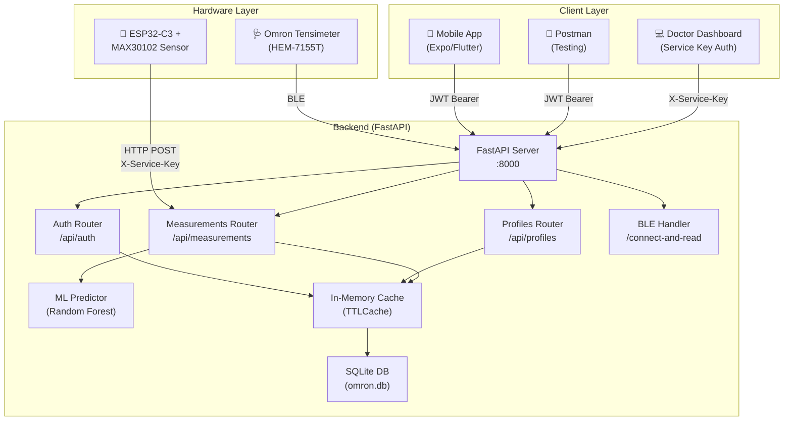
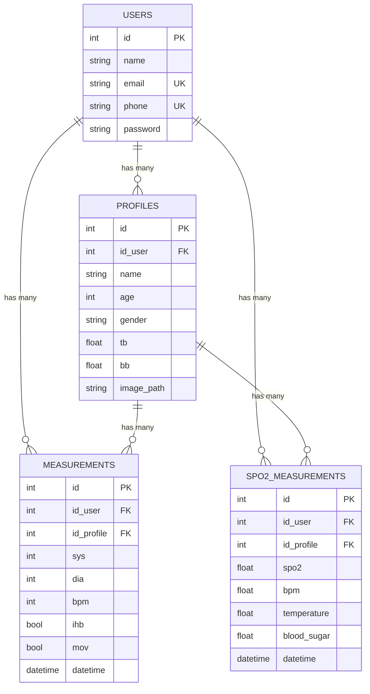
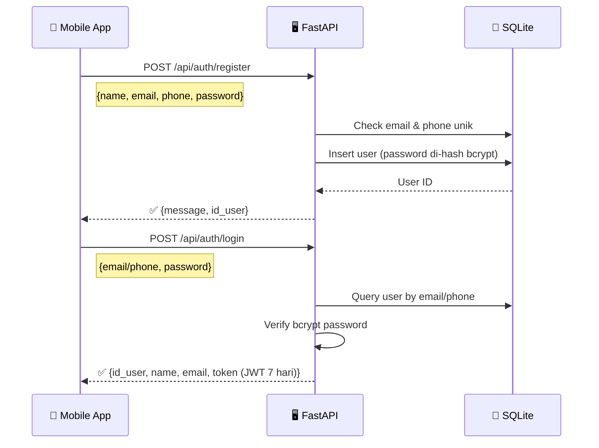
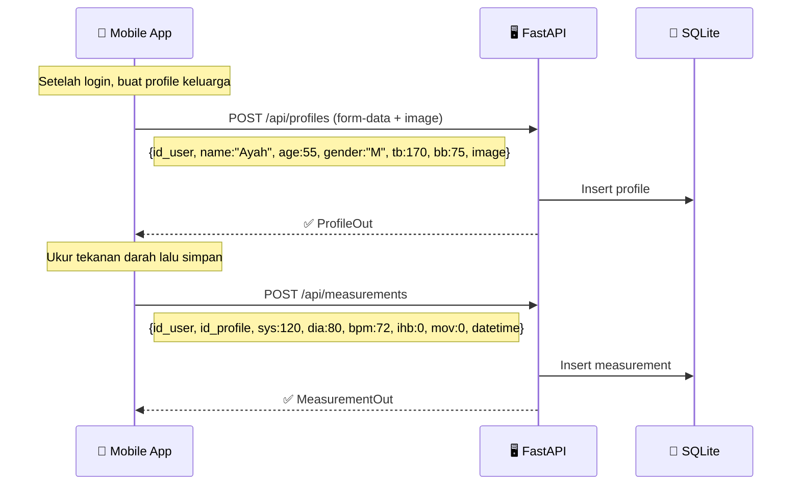
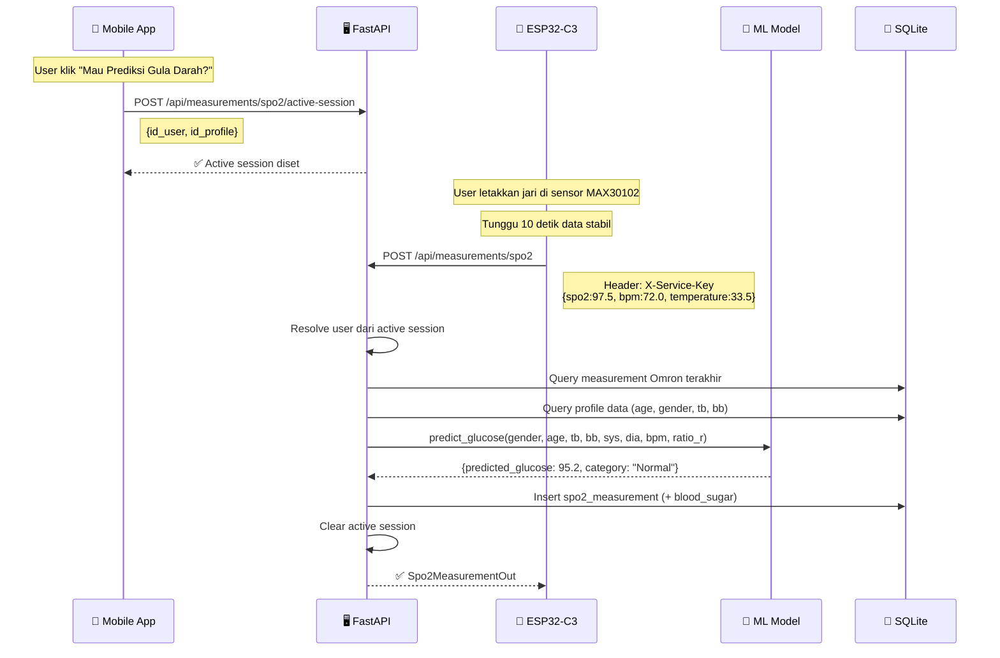
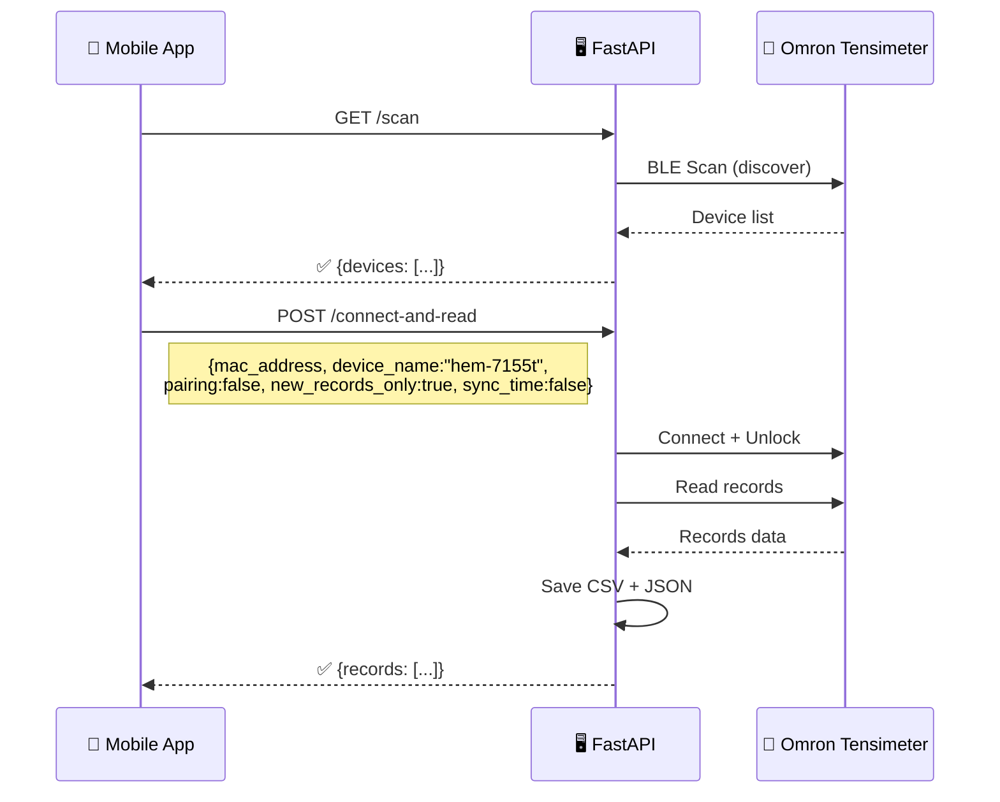
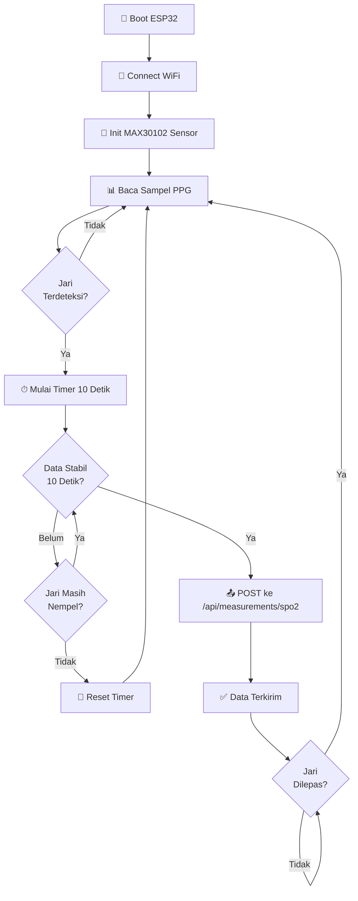

# 📋 Dokumentasi Lengkap — Tensimeter & MAX30102 Multiuser System

## 📖 Daftar Isi

1. [Gambaran Umum Proyek](#-gambaran-umum-proyek)
2. [Arsitektur Sistem](#-arsitektur-sistem)
3. [Struktur Proyek](#-struktur-proyek)
4. [Database Schema (ERD)](#-database-schema-erd)
5. [Flow Aplikasi](#-flow-aplikasi)
6. [Instalasi & Menjalankan Server](#-instalasi--menjalankan-server)
7. [API Reference Lengkap](#-api-reference-lengkap)
8. [Panduan Penggunaan di Postman](#-panduan-penggunaan-di-postman)
9. [ESP32 & MAX30102 Integration](#-esp32--max30102-integration)
10. [ML Prediction (Gula Darah)](#-ml-prediction-gula-darah)

---

## 🎯 Gambaran Umum Proyek

Sistem **Tensimeter & MAX30102 Multiuser** adalah platform kesehatan terintegrasi yang menggabungkan:

| Komponen | Fungsi |
|---|---|
| **Omron BLE Tensimeter** (HEM-7155T dll.) | Mengukur tekanan darah (Systolic, Diastolic, BPM) via Bluetooth Low Energy |
| **MAX30102 + ESP32-C3** | Mengukur SpO₂ (oksigen darah), BPM, dan temperatur chip |
| **FastAPI Backend** | REST API untuk manajemen user, profile, dan data pengukuran |
| **ML Predictor** | Prediksi kadar gula darah menggunakan Random Forest (in-process) |
| **Expo/Flutter Mobile App** | Antarmuka pengguna untuk multi-profile family health tracking |

> [!IMPORTANT]
> Sistem mendukung **multiuser & multi-profile** — satu akun user bisa memiliki beberapa profile (Ayah, Ibu, Anak, dll.), masing-masing dengan riwayat pengukuran terpisah.

---

## 🏗 Arsitektur Sistem



### Dual Authentication Mode

| Mode | Header | Digunakan Oleh |
|---|---|---|
| **JWT Bearer Token** | `Authorization: Bearer <token>` | Mobile app (user biasa) |
| **Service Key** | `X-Service-Key: <key>` | ESP32, Doctor Dashboard (server-to-server) |

---

## 📂 Struktur Proyek

```
Tensimeter-and-MAX30102/
├── main.py                          # Entry point FastAPI + BLE endpoints
├── database.py                      # SQLAlchemy engine & session config
├── models.py                        # ORM models (User, Profile, Measurement, Spo2)
├── schemas.py                       # Pydantic schemas (request/response)
├── cache.py                         # In-memory TTL cache module
├── websocket.py                     # WebSocket endpoint untuk real-time BLE data
├── omblepy.py                       # Omron BLE protocol handler
├── omblepy_bridge.py                # Bridge untuk komunikasi BLE
├── sharedDriver.py                  # Shared driver untuk perangkat Omron
│
├── routers/
│   ├── auth.py                      # Register, Login, JWT, Service Key auth
│   ├── profiles.py                  # CRUD profiles + image upload
│   └── measurements.py             # BP & SpO2 measurements + ML prediction
│
├── deviceSpecific/
│   ├── hem-7155t.py                 # Driver Omron HEM-7155T
│   ├── hem-7142t.py                 # Driver Omron HEM-7142T
│   ├── hem-7322t.py                 # ... dan lainnya
│   └── ...
│
├── ml_model/
│   ├── predictor.py                 # In-process glucose predictor
│   ├── model_v6.joblib              # Trained Random Forest model
│   ├── scaler_v6.joblib             # Feature scaler
│   ├── metadata_v6.joblib           # Model metadata
│   └── train_v6.py                  # Training script
│
├── max30102_esp32c3_oled_oximeter.ino  # Firmware ESP32-C3
├── frontend/index.html              # Simple web UI
├── uploads/                         # Profile images
├── .env                             # Environment variables
├── .env.example                     # Template environment
├── requirements.txt                 # Python dependencies
└── omron.db                         # SQLite database
```

---

## 🗄 Database Schema (ERD)



### Keterangan Field

| Table | Field | Deskripsi |
|---|---|---|
| **profiles** | `tb` | Tinggi badan (cm) |
| **profiles** | `bb` | Berat badan (kg) |
| **measurements** | `sys` | Systolic blood pressure (mmHg) |
| **measurements** | `dia` | Diastolic blood pressure (mmHg) |
| **measurements** | `ihb` | Irregular Heartbeat detected |
| **measurements** | `mov` | Body Movement detected |
| **spo2_measurements** | `spo2` | Oxygen saturation (%) |
| **spo2_measurements** | `blood_sugar` | Predicted glucose (mg/dL) dari ML model |

---

## 🔄 Flow Aplikasi

### Flow 1: Registrasi & Login User



### Flow 2: Buat Profile & Ukur Tekanan Darah



### Flow 3: Pengukuran SpO2 + Prediksi Gula Darah (ESP32)



### Flow 4: BLE Connect & Read (Omron Direct)



---

## ⚙ Instalasi & Menjalankan Server

### 1. Clone & Setup Environment

```bash
cd d:\Multiuser\Tensimeter-and-MAX30102

# Buat virtual environment
python -m venv .venv
.venv\Scripts\activate    # Windows

# Install dependencies
pip install -r requirements.txt
```

### 2. Konfigurasi `.env`

```env
SECRET_KEY=replace-this-with-a-long-random-secret
ML_API_URL=http://127.0.0.1:8005/predict
BCRYPT_ROUNDS=4           # 4 untuk dev, 10 untuk production
LOG_LEVEL=WARNING         # DEBUG | INFO | WARNING
SERVICE_KEY=your-service-key-here
```

> [!TIP]
> Generate SECRET_KEY dengan menjalankan:
> ```python
> python secretkey-generate.py
> ```

### 3. Jalankan Server

```bash
uvicorn main:app --host 0.0.0.0 --port 8000 --reload
```

Server berjalan di: `http://localhost:8000`\
Swagger UI: `http://localhost:8000/docs`\
ReDoc: `http://localhost:8000/redoc`

---

## 📡 API Reference Lengkap

### Base URL

```
http://localhost:8000
```

---

### 🔐 Auth — `/api/auth`

---

#### `POST /api/auth/register`

Registrasi user baru.

**Request Body** (JSON):
```json
{
    "name": "Ahmad Fauzi",
    "email": "ahmad@gmail.com",
    "phone": "081234567890",
    "password": "rahasia123"
}
```

**Response** `200 OK`:
```json
{
    "message": "Registrasi berhasil.",
    "id_user": 1
}
```

**Error Responses**:
| Code | Detail |
|---|---|
| `400` | Email sudah terdaftar. |
| `400` | Nomor HP sudah terdaftar. |

---

#### `POST /api/auth/login`

Login dengan email **atau** nomor HP.

**Request Body** (JSON):
```json
{
    "email": "ahmad@gmail.com",
    "password": "rahasia123"
}
```

Atau dengan nomor HP:
```json
{
    "phone": "081234567890",
    "password": "rahasia123"
}
```

**Response** `200 OK`:
```json
{
    "id_user": 1,
    "name": "Ahmad Fauzi",
    "email": "ahmad@gmail.com",
    "token": "eyJhbGciOiJIUzI1NiIsInR5cCI6IkpXVCJ9..."
}
```

> [!IMPORTANT]
> **Token JWT berlaku 7 hari**. Gunakan token ini pada header `Authorization: Bearer <token>` di setiap request yang memerlukan autentikasi.

**Error Responses**:
| Code | Detail |
|---|---|
| `400` | Email atau nomor HP harus diisi. |
| `401` | Email/nomor HP atau password salah. |

---

### 👤 Profiles — `/api/profiles`

> Semua endpoint memerlukan **Authorization: Bearer \<token\>** kecuali disebutkan lain.

---

#### `POST /api/profiles`

Buat profile baru (mendukung upload foto).

**Auth**: Bearer Token\
**Content-Type**: `multipart/form-data`

**Form Fields**:
| Field | Type | Required | Deskripsi |
|---|---|---|---|
| `id_user` | int | ✅ | ID user pemilik profile |
| `name` | string | ✅ | Nama profile (misal: "Ayah") |
| `age` | int | ✅ | Umur |
| `gender` | string | ✅ | "M" atau "F" |
| `tb` | float | ✅ | Tinggi badan (cm) |
| `bb` | float | ✅ | Berat badan (kg) |
| `image` | file | ❌ | Foto profile (opsional) |

**Response** `200 OK`:
```json
{
    "id": 1,
    "id_user": 1,
    "name": "Ayah",
    "age": 55,
    "gender": "M",
    "tb": 170.0,
    "bb": 75.0,
    "image_url": "/uploads/profile_abc123.jpg"
}
```

**Error Responses**:
| Code | Detail |
|---|---|
| `403` | Tidak diizinkan membuat profile untuk user lain. |
| `404` | User tidak ditemukan. |

---

#### `GET /api/profiles/{id_user}`

Ambil semua profile milik user.

**Auth**: Bearer Token **atau** X-Service-Key

**Response** `200 OK`:
```json
[
    {
        "id": 1,
        "id_user": 1,
        "name": "Ayah",
        "age": 55,
        "gender": "M",
        "tb": 170.0,
        "bb": 75.0,
        "image_url": "/uploads/profile_abc123.jpg"
    },
    {
        "id": 2,
        "id_user": 1,
        "name": "Ibu",
        "age": 50,
        "gender": "F",
        "tb": 160.0,
        "bb": 60.0,
        "image_url": null
    }
]
```

---

#### `GET /api/profiles/search?phone={phone}`

Cari user berdasarkan nomor telepon (digunakan dashboard dokter).

**Auth**: Bearer Token **atau** X-Service-Key

**Query Parameters**:
| Param | Type | Deskripsi |
|---|---|---|
| `phone` | string | Nomor telepon yang dicari |

**Response** `200 OK`:
```json
{
    "id_user": 1,
    "name": "Ahmad Fauzi",
    "phone": "081234567890",
    "profiles": [
        {
            "id": 1,
            "id_user": 1,
            "name": "Ayah",
            "age": 55,
            "gender": "M",
            "tb": 170.0,
            "bb": 75.0,
            "image_url": null
        }
    ]
}
```

---

#### `DELETE /api/profiles/{id_profile}`

Hapus profile berdasarkan ID.

**Auth**: Bearer Token

**Response** `200 OK`:
```json
{
    "message": "Profile berhasil dihapus."
}
```

---

### 📊 Measurements — `/api/measurements`

---

#### `POST /api/measurements`

Simpan hasil pengukuran tekanan darah dari Omron.

**Auth**: Bearer Token

**Request Body** (JSON):
```json
{
    "id_user": 1,
    "id_profile": 1,
    "sys": 120,
    "dia": 80,
    "bpm": 72,
    "ihb": 0,
    "mov": 0,
    "datetime": "2026-07-08T16:30:00"
}
```

**Response** `200 OK`:
```json
{
    "id": 1,
    "id_user": 1,
    "id_profile": 1,
    "sys": 120,
    "dia": 80,
    "bpm": 72,
    "ihb": false,
    "mov": false,
    "datetime": "2026-07-08T16:30:00"
}
```

---

#### `GET /api/measurements/{id_profile}?skip=0&limit=50`

Ambil riwayat pengukuran tekanan darah dengan pagination.

**Auth**: Bearer Token **atau** X-Service-Key

**Query Parameters**:
| Param | Type | Default | Deskripsi |
|---|---|---|---|
| `skip` | int | 0 | Offset (mulai dari record ke-n) |
| `limit` | int | 50 | Maks record per halaman (1–200) |

**Response** `200 OK`:
```json
[
    {
        "id": 5,
        "id_user": 1,
        "id_profile": 1,
        "sys": 125,
        "dia": 82,
        "bpm": 75,
        "ihb": false,
        "mov": false,
        "datetime": "2026-07-08T16:30:00"
    }
]
```

---

#### `GET /api/measurements/{id_profile}/latest`

Ambil pengukuran tekanan darah terbaru untuk dashboard.

**Auth**: Bearer Token **atau** X-Service-Key

**Response** `200 OK`:
```json
{
    "id": 5,
    "id_user": 1,
    "id_profile": 1,
    "sys": 125,
    "dia": 82,
    "bpm": 75,
    "ihb": false,
    "mov": false,
    "datetime": "2026-07-08T16:30:00"
}
```

---

#### `POST /api/measurements/spo2/active-session`

Set active session untuk ESP32 (dipanggil saat user klik "Mau Prediksi Gula Darah?").

**Auth**: Bearer Token

**Request Body** (JSON):
```json
{
    "id_user": 1,
    "id_profile": 1
}
```

**Response** `200 OK`:
```json
{
    "message": "Active session berhasil diset.",
    "id_user": 1,
    "id_profile": 1
}
```

---

#### `GET /api/measurements/spo2/active-session`

Cek session aktif saat ini (debugging / ESP32).

**Auth**: Tidak diperlukan

**Response** `200 OK`:
```json
{
    "message": "Session aktif ditemukan.",
    "id_user": 1,
    "id_profile": 1
}
```

**Error**: `404` — Tidak ada session aktif.

---

#### `POST /api/measurements/spo2`

Simpan data SpO2 dari sensor MAX30102. Mendukung 2 mode:

| Mode | Cara | id_user / id_profile |
|---|---|---|
| **ESP32** | Header `X-Service-Key` | Opsional — diambil dari active session |
| **Mobile App** | Header `Authorization: Bearer <token>` | Wajib diisi |

**Request Body** (JSON):
```json
{
    "spo2": 97.5,
    "bpm": 72.0,
    "temperature": 33.5,
    "id_user": 1,
    "id_profile": 1,
    "datetime": "2026-07-08T16:35:00"
}
```

Untuk ESP32 (tanpa id_user/id_profile — diambil dari active session):
```json
{
    "spo2": 97.5,
    "bpm": 72.0,
    "temperature": 33.5
}
```

**Response** `200 OK`:
```json
{
    "id": 1,
    "id_user": 1,
    "id_profile": 1,
    "spo2": 97.5,
    "bpm": 72.0,
    "temperature": 33.5,
    "blood_sugar": 95.23,
    "datetime": "2026-07-08T16:35:00"
}
```

> [!NOTE]
> Field `blood_sugar` berisi prediksi gula darah dari ML model. Akan `null` jika ML model tidak tersedia atau belum ada data Omron sebelumnya.

**Prasyarat**:
1. Profile harus sudah ada
2. Minimal 1 pengukuran tekanan darah (Omron) sudah tersimpan untuk profile tersebut
3. Jika dari ESP32: active session harus sudah di-set

**Error Responses**:
| Code | Detail |
|---|---|
| `400` | ESP32 tanpa active session |
| `400` | Harus mengukur tekanan darah terlebih dahulu |
| `403` | Tidak diizinkan menyimpan data untuk user lain |
| `422` | id_user dan id_profile wajib diisi (mobile mode) |

---

#### `GET /api/measurements/{id_profile}/spo2?skip=0&limit=50`

Ambil riwayat pengukuran SpO2 dengan pagination.

**Auth**: Bearer Token **atau** X-Service-Key

**Response** `200 OK`:
```json
[
    {
        "id": 1,
        "id_user": 1,
        "id_profile": 1,
        "spo2": 97.5,
        "bpm": 72.0,
        "temperature": 33.5,
        "blood_sugar": 95.23,
        "datetime": "2026-07-08T16:35:00"
    }
]
```

---

#### `GET /api/measurements/{id_profile}/spo2/latest`

Ambil data SpO2 terbaru.

**Auth**: Bearer Token **atau** X-Service-Key

**Response** `200 OK`: (sama seperti satu item di atas)

---

### 🔵 BLE Endpoints (Omron Direct)

---

#### `GET /scan`

Scan perangkat BLE di sekitar.

**Auth**: Tidak diperlukan

**Response** `200 OK`:
```json
{
    "devices": [
        {
            "address": "AA:BB:CC:DD:EE:FF",
            "name": "BLESmart_00001234"
        }
    ],
    "message": "Perangkat BLE berhasil dipindai"
}
```

---

#### `POST /connect-and-read`

Connect ke Omron dan baca semua data.

**Auth**: Tidak diperlukan

**Request Body** (JSON):
```json
{
    "mac_address": "AA:BB:CC:DD:EE:FF",
    "device_name": "hem-7155t",
    "pairing": false,
    "new_records_only": true,
    "sync_time": false,
    "user_index": 0
}
```

| Field | Type | Deskripsi |
|---|---|---|
| `mac_address` | string | MAC address perangkat BLE |
| `device_name` | string | Nama driver device (hem-7155t, hem-7142t, dll.) |
| `pairing` | bool | `true` = hanya pairing, `false` = baca data |
| `new_records_only` | bool | Hanya ambil record yang belum dibaca |
| `sync_time` | bool | Sinkronisasi waktu perangkat |
| `user_index` | int | 0 = User 1, 1 = User 2 (multi-user device) |

---

#### `POST /latest-bp-records`

Connect ke Omron dan baca hanya record terbaru.

**Request Body**: Sama seperti `/connect-and-read`

---

#### `GET /`

Health check endpoint.

**Response**: `{"message": "Omron BLE Python Backend is running"}`

---

#### `GET /ui`

Tampilkan web UI bawaan.

---

## 📬 Panduan Penggunaan di Postman

### Step 0: Setup Environment Postman

Buat **Environment** di Postman dengan variabel berikut:

| Variable | Initial Value | Keterangan |
|---|---|---|
| `base_url` | `http://localhost:8000` | URL server backend |
| `token` | _(kosong)_ | Akan diisi otomatis setelah login |
| `id_user` | _(kosong)_ | Akan diisi otomatis setelah register/login |
| `id_profile` | _(kosong)_ | Akan diisi setelah buat profile |
| `service_key` | `your-service-key` | Service key untuk ESP32/dashboard |

---

### Step 1: Register User Baru

```
POST {{base_url}}/api/auth/register
```

**Headers**:
```
Content-Type: application/json
```

**Body** (raw JSON):
```json
{
    "name": "Ahmad Fauzi",
    "email": "ahmad@gmail.com",
    "phone": "081234567890",
    "password": "rahasia123"
}
```

**Tests** (untuk auto-save `id_user` ke environment):
```javascript
if (pm.response.code === 200) {
    var jsonData = pm.response.json();
    pm.environment.set("id_user", jsonData.id_user);
    console.log("id_user saved:", jsonData.id_user);
}
```

---

### Step 2: Login

```
POST {{base_url}}/api/auth/login
```

**Headers**:
```
Content-Type: application/json
```

**Body** (raw JSON):
```json
{
    "email": "ahmad@gmail.com",
    "password": "rahasia123"
}
```

**Tests** (untuk auto-save `token` dan `id_user`):
```javascript
if (pm.response.code === 200) {
    var jsonData = pm.response.json();
    pm.environment.set("token", jsonData.token);
    pm.environment.set("id_user", jsonData.id_user);
    console.log("Token saved successfully!");
}
```

---

### Step 3: Buat Profile

```
POST {{base_url}}/api/profiles
```

**Headers**:
```
Authorization: Bearer {{token}}
```

**Body** (`form-data`):
| Key | Type | Value |
|---|---|---|
| `id_user` | Text | `{{id_user}}` |
| `name` | Text | `Ayah` |
| `age` | Text | `55` |
| `gender` | Text | `M` |
| `tb` | Text | `170` |
| `bb` | Text | `75` |
| `image` | File | _(pilih file gambar, opsional)_ |

**Tests**:
```javascript
if (pm.response.code === 200) {
    var jsonData = pm.response.json();
    pm.environment.set("id_profile", jsonData.id);
    console.log("id_profile saved:", jsonData.id);
}
```

---

### Step 4: Lihat Semua Profile

```
GET {{base_url}}/api/profiles/{{id_user}}
```

**Headers**:
```
Authorization: Bearer {{token}}
```

---

### Step 5: Simpan Pengukuran Tekanan Darah

```
POST {{base_url}}/api/measurements
```

**Headers**:
```
Authorization: Bearer {{token}}
Content-Type: application/json
```

**Body** (raw JSON):
```json
{
    "id_user": {{id_user}},
    "id_profile": {{id_profile}},
    "sys": 120,
    "dia": 80,
    "bpm": 72,
    "ihb": 0,
    "mov": 0,
    "datetime": "2026-07-08T16:30:00"
}
```

---

### Step 6: Lihat Riwayat Tekanan Darah

```
GET {{base_url}}/api/measurements/{{id_profile}}?skip=0&limit=50
```

**Headers**:
```
Authorization: Bearer {{token}}
```

---

### Step 7: Lihat Pengukuran Terbaru

```
GET {{base_url}}/api/measurements/{{id_profile}}/latest
```

**Headers**:
```
Authorization: Bearer {{token}}
```

---

### Step 8: Set Active Session (Sebelum SpO2)

```
POST {{base_url}}/api/measurements/spo2/active-session
```

**Headers**:
```
Authorization: Bearer {{token}}
Content-Type: application/json
```

**Body** (raw JSON):
```json
{
    "id_user": {{id_user}},
    "id_profile": {{id_profile}}
}
```

---

### Step 9: Simpan Data SpO2 (Simulasi ESP32)

```
POST {{base_url}}/api/measurements/spo2
```

**Headers**:
```
X-Service-Key: {{service_key}}
Content-Type: application/json
```

> [!WARNING]
> Pastikan **Step 5** (simpan BP measurement) sudah dilakukan sebelum mengirim SpO2, karena prediksi gula darah memerlukan data tekanan darah Omron yang sudah ada.

**Body** (raw JSON):
```json
{
    "spo2": 97.5,
    "bpm": 72.0,
    "temperature": 33.5
}
```

**Response** akan berisi `blood_sugar` (prediksi gula darah) jika ML model tersedia.

---

### Step 10: Lihat Riwayat SpO2

```
GET {{base_url}}/api/measurements/{{id_profile}}/spo2?skip=0&limit=50
```

**Headers**:
```
Authorization: Bearer {{token}}
```

---

### Step 11: Lihat SpO2 Terbaru

```
GET {{base_url}}/api/measurements/{{id_profile}}/spo2/latest
```

**Headers**:
```
Authorization: Bearer {{token}}
```

---

### Step 12: Cari User by Phone (Dashboard Dokter)

```
GET {{base_url}}/api/profiles/search?phone=081234567890
```

**Headers**:
```
X-Service-Key: {{service_key}}
```

---

### Step 13: Hapus Profile

```
DELETE {{base_url}}/api/profiles/{{id_profile}}
```

**Headers**:
```
Authorization: Bearer {{token}}
```

---

### 📋 Ringkasan Endpoint Postman

| # | Method | Endpoint | Auth | Deskripsi |
|---|---|---|---|---|
| 1 | `POST` | `/api/auth/register` | ❌ | Register user baru |
| 2 | `POST` | `/api/auth/login` | ❌ | Login → dapat JWT token |
| 3 | `POST` | `/api/profiles` | 🔑 Bearer | Buat profile (form-data) |
| 4 | `GET` | `/api/profiles/{id_user}` | 🔑 Bearer / 🔐 Service | List semua profile |
| 5 | `GET` | `/api/profiles/search?phone=` | 🔑 Bearer / 🔐 Service | Cari user by phone |
| 6 | `DELETE` | `/api/profiles/{id_profile}` | 🔑 Bearer | Hapus profile |
| 7 | `POST` | `/api/measurements` | 🔑 Bearer | Simpan BP measurement |
| 8 | `GET` | `/api/measurements/{id_profile}` | 🔑 Bearer / 🔐 Service | Riwayat BP (paginated) |
| 9 | `GET` | `/api/measurements/{id_profile}/latest` | 🔑 Bearer / 🔐 Service | BP terbaru |
| 10 | `POST` | `/api/measurements/spo2/active-session` | 🔑 Bearer | Set active session |
| 11 | `GET` | `/api/measurements/spo2/active-session` | ❌ | Cek active session |
| 12 | `POST` | `/api/measurements/spo2` | 🔑 Bearer / 🔐 Service | Simpan SpO2 + prediksi gula |
| 13 | `GET` | `/api/measurements/{id_profile}/spo2` | 🔑 Bearer / 🔐 Service | Riwayat SpO2 (paginated) |
| 14 | `GET` | `/api/measurements/{id_profile}/spo2/latest` | 🔑 Bearer / 🔐 Service | SpO2 terbaru |
| 15 | `GET` | `/scan` | ❌ | Scan BLE devices |
| 16 | `POST` | `/connect-and-read` | ❌ | Connect Omron + baca data |
| 17 | `POST` | `/latest-bp-records` | ❌ | Baca record Omron terbaru |

> **Legenda Auth**: ❌ = Tidak perlu auth | 🔑 = JWT Bearer Token | 🔐 = X-Service-Key header

---

## 📡 ESP32 & MAX30102 Integration

### Hardware Setup

| Komponen | Pin ESP32-C3 |
|---|---|
| MAX30102 SDA | GPIO 8 |
| MAX30102 SCL | GPIO 9 |
| Heartbeat LED | GPIO 10 |

### Firmware Flow



### Data yang Dikirim ESP32

```
POST http://<server-ip>:8000/api/measurements/spo2
Headers:
  Content-Type: application/json
  X-Service-Key: <service-key>

Body:
{
    "spo2": 97.5,
    "bpm": 72.0,
    "temperature": 33.5
}
```

> [!NOTE]
> ESP32 **tidak mengirim** `id_user` dan `id_profile`. Backend otomatis mengambil dari **active session** yang sudah di-set oleh mobile app.

---

## 🤖 ML Prediction (Gula Darah)

### Model Info

| Property | Value |
|---|---|
| Algorithm | Random Forest |
| Version | v6 |
| File | `ml_model/model_v6.joblib` |
| Execution | In-process (tanpa HTTP, langsung di memory) |

### Input Features (12 fitur)

| # | Feature | Source |
|---|---|---|
| 1 | `gender_male` | Profile (0 = F, 1 = M) |
| 2 | `age` | Profile |
| 3 | `height_cm` | Profile (tb) |
| 4 | `weight_kg` | Profile (bb) |
| 5 | `sbp` | Measurement Omron terakhir (sys) |
| 6 | `dbp` | Measurement Omron terakhir (dia) |
| 7 | `bpm` | SpO2 sensor (BPM) |
| 8 | `ratio_r` | Dihitung: `(110 - spo2) / 25` |
| 9–12 | `ac_red, dc_red, ac_ir, dc_ir` | Imputed dari dataset mean (opsional) |

### Kategori Output (Klasifikasi ADA)

| Range (mg/dL) | Kategori | Risk Level |
|---|---|---|
| < 70 | Hypoglycemia (Rendah) | 🔴 TINGGI |
| 70 – 99 | Normal | 🟢 RENDAH |
| 100 – 125 | Prediabetes (IFG) | 🟡 SEDANG |
| 126 – 199 | Diabetes | 🔴 TINGGI |
| ≥ 200 | Diabetes Berat | ⚫ KRITIS |

### Analisis Kardiovaskular Tambahan

Setiap prediksi juga menyertakan analisis:
- **BMI** + kategori (Underweight / Normal / Overweight / Obese)
- **Pulse Pressure** (mmHg)
- **Mean Arterial Pressure** (mmHg)
- **BP Category** (Normal / Elevated / Hypertension Stage 1–2)
- **Rate Pressure Product** + kategori stres miokardial

---

## 🗂 Perangkat Omron yang Didukung

| Device | Driver File |
|---|---|
| HEM-6232T | `deviceSpecific/hem-6232t.py` |
| HEM-7142T | `deviceSpecific/hem-7142t.py` |
| HEM-7150T | `deviceSpecific/hem-7150t.py` |
| HEM-7155T | `deviceSpecific/hem-7155t.py` |
| HEM-7322T | `deviceSpecific/hem-7322t.py` |
| HEM-7342T | `deviceSpecific/hem-7342t.py` |
| HEM-7361T | `deviceSpecific/hem-7361t.py` |
| HEM-7530T | `deviceSpecific/hem-7530t.py` |
| HEM-7600T | `deviceSpecific/hem-7600t.py` |

---

## ⚡ Optimasi Performa

| Fitur | Detail |
|---|---|
| **GZip Compression** | Response > 500 bytes dikompresi (hemat 60–80% bandwidth) |
| **SQLite WAL Mode** | Concurrent read/write |
| **Connection Pool** | 40 connections + 60 overflow |
| **TTL Cache** | User (5min), Profile (1min), Measurements (10–15s) |
| **Async Bcrypt** | Thread pool 32 workers untuk hash password |
| **expire_on_commit=False** | Skip `db.refresh()` — hemat 1 DB round-trip per write |
| **Memory-mapped I/O** | 256MB mmap untuk SQLite |
