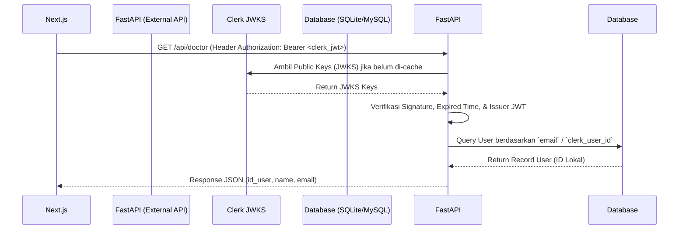

# Rencana Implementasi: Endpoint `/api/doctor` pada FastAPI

Dokumen ini menjelaskan rancangan teknis untuk menambahkan endpoint `/api/doctor` di sisi FastAPI backend (Python). Endpoint ini bertindak sebagai jembatan untuk mencocokkan user yang login via **Clerk** di Next.js dengan `id_user` lokal yang ada di SQLite/MySQL FastAPI.

---

## 1. Alur Kerja Autentikasi & Mapping



---

## 2. Kebutuhan Variabel Environment (di FastAPI `.env`)

Agar FastAPI bisa memverifikasi token JWT dari Clerk, Anda membutuhkan parameter berikut:
```ini
CLERK_API_URL=https://api.clerk.com/v1
CLERK_JWKS_URL=https://<your-clerk-frontend-api>/.well-known/jwks.json
CLERK_JWT_ISSUER=https://<your-clerk-frontend-api>
```
*Catatan: Ganti `<your-clerk-frontend-api>` dengan URL Clerk Instance Anda (misalnya `https://eternal-goshawk-36.clerk.accounts.dev`).*

---

## 3. Desain Database Model (User)

Pastikan tabel `users` di database FastAPI memiliki kolom untuk melakukan pencocokan:

### Opsi A (Rekomendasi - Match by Email)
Karena email dari Clerk terverifikasi, Anda bisa mencocokkan field `email` langsung:
```sql
SELECT id FROM users WHERE email = :email_clerk;
```

### Opsi B (Paling Aman - Match by Clerk ID)
Tambahkan kolom baru `clerk_user_id` pada tabel `users` di database FastAPI:
```sql
ALTER TABLE users ADD COLUMN clerk_user_id VARCHAR(255) UNIQUE;
```

---

## 4. Contoh Kode Implementasi Python (FastAPI)

Berikut adalah contoh rancangan kode Python menggunakan library `pyjwt` untuk memverifikasi token dan mengambil data dokter:

```python
import jwt
from fastapi import APIRouter, Depends, HTTPException, Header
from sqlalchemy.orm import Session
import requests
from database import get_db
import models

router = APIRouter()

# URL JWKS Clerk untuk memvalidasi token
CLERK_JWKS_URL = "https://eternal-goshawk-36.clerk.accounts.dev/.well-known/jwks.json"
CLERK_ISSUER = "https://eternal-goshawk-36.clerk.accounts.dev"

# Cache JWKS agar tidak fetch setiap request
jwks_client = jwt.PyJWKClient(CLERK_JWKS_URL)

def get_current_clerk_user(authorization: str = Header(None)):
    if not authorization or not authorization.startswith("Bearer "):
        raise HTTPException(status_code=401, detail="Missing or invalid token format")
    
    token = authorization.split(" ")[1]
    
    try:
        # 1. Dapatkan Public Key dari JWKS yang cocok dengan header kid token
        signing_key = jwks_client.get_signing_key_from_jwt(token)
        
        # 2. Decode dan verifikasi token
        payload = jwt.decode(
            token,
            signing_key.key,
            algorithms=["RS256"],
            audience=None, # Clerk access token tidak selalu menyertakan aud
            issuer=CLERK_ISSUER
        )
        return payload
    except jwt.ExpiredSignatureError:
        raise HTTPException(status_code=401, detail="Token has expired")
    except jwt.InvalidTokenError as e:
        raise HTTPException(status_code=401, detail=f"Invalid token: {str(e)}")
    except Exception as e:
        raise HTTPException(status_code=500, detail="Internal token validation error")

@router.get("/api/doctor")
def get_doctor_profile(
    current_user: dict = Depends(get_current_clerk_user),
    db: Session = Depends(get_db)
):
    # Payload Clerk berisi claim seperti 'sub' (clerk ID) dan 'email'
    clerk_user_id = current_user.get("sub")
    email = current_user.get("email") # atau claim kustom lainnya
    
    # Cari di database lokal
    # Opsi: Cari berdasarkan email terlebih dahulu
    user = db.query(models.User).filter(models.User.email == email).first()
    
    if not user:
        # Jika belum ada, Anda bisa melakukan Auto-Register atau return 404
        raise HTTPException(
            status_code=404, 
            detail=f"User dengan email {email} belum terdaftar di database lokal"
        )
        
    return {
        "id_user": user.id,          # ID integer lokal FastAPI
        "name": user.name,            # Nama di database lokal
        "email": user.email           # Email
    }
```

---

## 5. Output Response Schema

Bila request berhasil, endpoint **wajib** mengembalikan response berformat JSON berikut agar Next.js bisa memproses data pasien:

```json
{
  "id_user": 5,
  "name": "Dr. Faqih Naufaldy",
  "email": "faqihnfldy@gmail.com"
}
```

---

## 6. Uji Coba Integrasi
1. Jalankan FastAPI server.
2. Buka Next.js Dashboard.
3. Next.js akan mengirim token JWT Clerk secara otomatis ke `GET /api/doctor`.
4. Jika response 200 OK dan mengembalikan JSON di atas, Next.js akan langsung memproses fetch pasien-pasien di bawah `id_user: 5`.